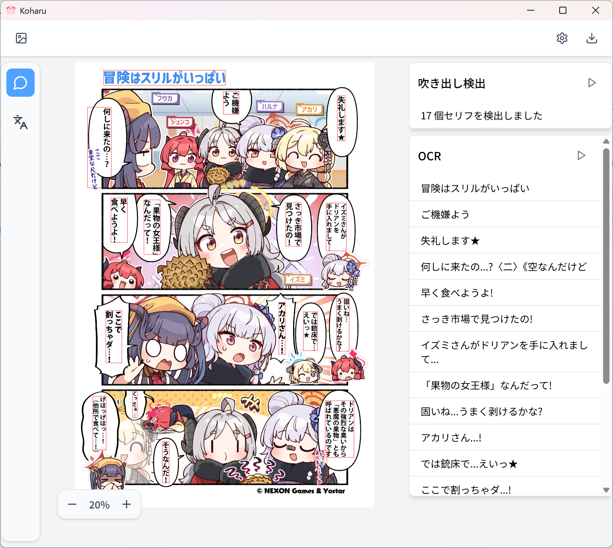
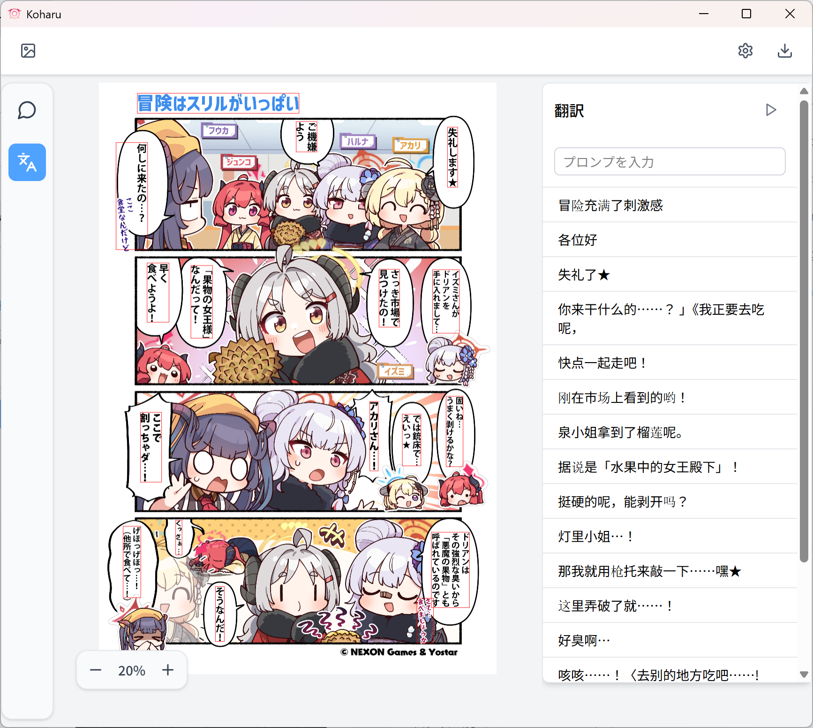

# Koharu

LLM を使った自動漫画翻訳ツール。

Automated manga translation tool with LLM, written in **Rust**.

Koharu introduces a new workflow for manga translation, utilizing the power of LLMs to automate the process. It combines the capabilities of object detection, OCR, inpainting, and LLMs to create a seamless translation experience.

Koharu is built with Rust, ensuring high performance and reliability. The bundle is extremely lightweight (less than 20MB) and can be run on any machine without any dependencies.

> [!NOTE]
> For help and support, please join our [Discord server](https://discord.gg/mHvHkxGnUY).

## Preview




The build is available for Windows, MacOS, and Linux. You can download the latest release from the [releases page](https://github.com/mayocream/koharu/releases/latest).

> [!NOTE]
> Koharu is still in development and may not work perfectly. Please report any issues you encounter on the [issues page](https://github.com/mayocream/koharu/issues).

## Technology

Koharu is built using Tauri, a framework for building lightweight, secure, and fast desktop applications. The interface is built with React and Konva, written in TypeScript. The machine learning models are re-implemented in Rust, using the Ort ONNX runtime for inference. The models are optimized for performance and can run on any machine without the need for a GPU.

## Guidance

To use CUDA acceleration, you need to install the [CUDA toolkit 12.6](https://developer.nvidia.com/cuda-12-6-0-download-archive) and the [cuDNN 9.8.0 for CUDA 12](https://developer.nvidia.com/cudnn-downloads) library.

## Workflow

The workflow of translation consists of the following steps:

- [x] Detect the text in the manga using a text detection model.
- [x] Extract the detected text using an OCR model.
- [x] Translate the extracted text using an LLM.
- [x] Inpaint the translated text back into the manga using an inpainting model.

## Models

- [comic-text-detector](https://github.com/dmMaze/comic-text-detector) - Detects text in manga images.
- [manga-ocr](https://github.com/kha-white/manga-ocr) - Extracts text from manga images.
- [AnimeMangaInpainting](https://huggingface.co/dreMaz/AnimeMangaInpainting) - Finetuned LaMa model for inpainting manga images.

You can find the ONNX models we actually use below:

- [comic-text-detector-onnx](https://huggingface.co/mayocream/comic-text-detector-onnx)
- [manga-ocr-onnx](https://huggingface.co/mayocream/manga-ocr-onnx)
- [lama-manga-onnx](https://huggingface.co/mayocream/lama-manga-onnx)

## Development

### Prerequisites

Please follow the instructions on the [Tauri documentation](https://tauri.app/start/prerequisites/) to install the required dependencies of Tauri.

- Rust 1.85
- Bun

#### Windows

Please install [Visual Studio C++ Build tools](https://visualstudio.microsoft.com/visual-cpp-build-tools/) first.

Then, install the dependencies using the following commands in PowerShell:

```powershell
winget install --id=Oven-sh.Bun
winget install rustlang.rustup

rustup
```

### Build

```bash
bun install
bun tauri dev
```

To create a debug build, run:

```bash
bun tauri build --debug
```

### Features

To enable `cuda` acceleration, run `bun` with the `--features cuda` flag:

```bash
bun tauri dev --features cuda
```
